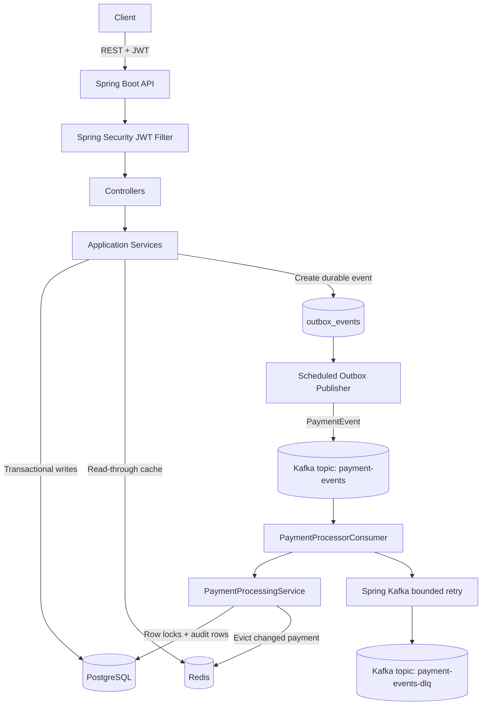
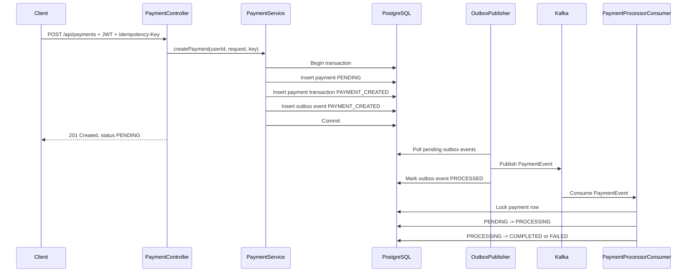
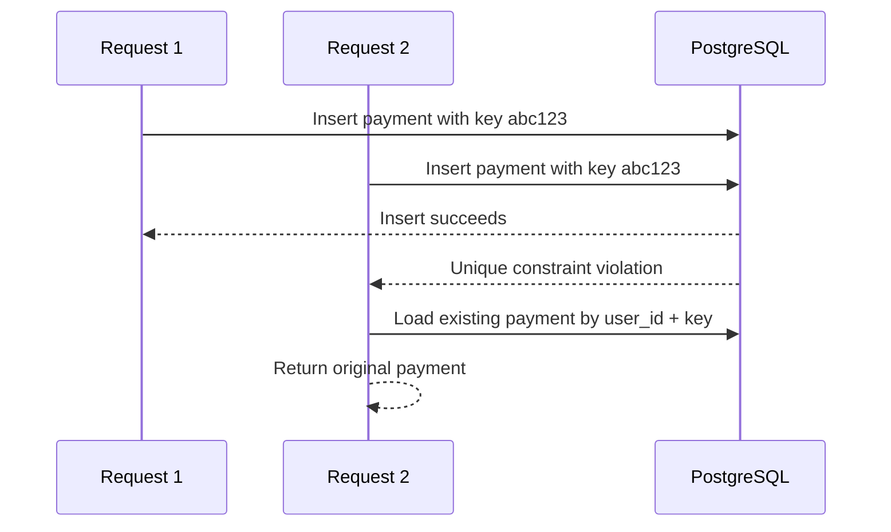
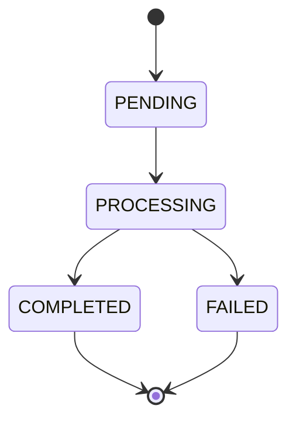

# Payment Processing System

Production-style backend payment platform built with Java 17, Spring Boot 3, PostgreSQL, Redis, Kafka, Docker, JWT authentication, Flyway, and Testcontainers.

This project is designed as an SDE/backend interview portfolio project. It is intentionally more than CRUD: it demonstrates idempotency, transactional consistency, asynchronous processing, retries, a dead letter topic, caching, validation, centralized exception handling, and concurrency-safe state transitions.

## 1. What The System Does

Authenticated users can:

- Register and log in with JWT authentication.
- Create payments with an `Idempotency-Key`.
- Retrieve one payment.
- List their own payments with pagination and optional status filtering.
- Have payments processed asynchronously through Kafka.
- Track payment status through `PENDING`, `PROCESSING`, `COMPLETED`, and `FAILED`.
- Avoid duplicate payments when clients retry the same create request.

The payment gateway is simulated. No real Stripe, PayPal, bank, or card processor is called.

## 2. Technology Stack

| Area | Technology |
| --- | --- |
| Language | Java 17 |
| Framework | Spring Boot 3 |
| API | Spring Web REST |
| Persistence | Spring Data JPA, Hibernate |
| Database | PostgreSQL |
| Migrations | Flyway |
| Cache | Redis |
| Messaging | Apache Kafka, Spring Kafka |
| Security | Spring Security, JWT, BCrypt |
| Validation | Jakarta Bean Validation |
| Docs | Springdoc OpenAPI / Swagger |
| Observability | Actuator, request ID logging |
| Tests | JUnit 5, Mockito, Testcontainers |
| Packaging | Maven, Docker, Docker Compose |

## 3. High-Level Architecture



## 4. Package Structure

```text
com.paymentprocessing
├── cache          Redis cache wrapper
├── config         Security, Kafka, Redis, OpenAPI, request ID config
├── controller     REST controllers
├── dto            Request and response DTOs
├── entity         JPA entities and enums
├── exception      Custom exceptions and global handler
├── kafka          Event records, producer, consumer
├── mapper         Entity-to-DTO mapping
├── repository     Spring Data repositories
├── security       JWT and user principal logic
├── service        Business logic and outbox publisher
└── util           Payment state machine
```

Controllers do not expose JPA entities. API models are separated into DTOs.

## 5. Main Request Flow

### Create Payment



## 6. Database Design

### `users`

Stores authenticated users.

| Column | Purpose |
| --- | --- |
| `id` | UUID primary key |
| `email` | Unique login identifier |
| `password` | BCrypt hash |
| `created_at`, `updated_at` | Audit timestamps |

### `payments`

Stores durable payment state.

| Column | Purpose |
| --- | --- |
| `id` | UUID primary key |
| `user_id` | Owner of payment |
| `amount` | `NUMERIC(19,2)` monetary amount |
| `currency` | ISO currency code |
| `status` | `PENDING`, `PROCESSING`, `COMPLETED`, `FAILED` |
| `payment_method` | `CARD`, `BANK_TRANSFER`, `WALLET` |
| `idempotency_key` | Client retry key |
| `version` | JPA optimistic locking |
| `created_at`, `updated_at` | Audit timestamps |

### `payment_transactions`

Append-only audit trail for state changes.

| Transaction Type | Meaning |
| --- | --- |
| `PAYMENT_CREATED` | Payment was created as pending |
| `PAYMENT_PROCESSING` | Processor started work |
| `PAYMENT_COMPLETED` | Processing succeeded |
| `PAYMENT_FAILED` | Processing failed permanently |

### `outbox_events`

Durable event buffer used by the transactional outbox pattern.

| Column | Purpose |
| --- | --- |
| `aggregate_id` | Payment ID |
| `event_type` | Example: `PAYMENT_CREATED` |
| `payload` | Serialized event JSON |
| `status` | `PENDING`, `PROCESSED`, `FAILED` |
| `processed_at` | Publication timestamp |

## 7. Indexing Strategy

| Index | Why It Exists |
| --- | --- |
| `users.email` | Fast login and duplicate registration checks |
| `payments.user_id` | Fast listing of a user's payments |
| `payments.status` | Efficient filtering and operational queries |
| `payments.created_at` | Efficient chronological pagination |
| `payments.idempotency_key` | Fast duplicate request lookup |
| `(payments.user_id, payments.idempotency_key)` unique constraint | Correct idempotency under concurrency |
| `outbox_events(status, created_at)` | Efficient polling of pending events |

## 8. Idempotency Design

Payment creation is idempotent per user and idempotency key.

Client sends:

```http
POST /api/payments
Authorization: Bearer <token>
Idempotency-Key: payment-123
```

If the same authenticated user sends the same key again, the API returns the original payment instead of creating a duplicate.

Concurrency handling:



This works across multiple application instances because the database constraint is the source of truth. No in-memory map is used.

## 9. Transactional Outbox Design

The system does not pretend that PostgreSQL and Kafka participate in one atomic transaction.

Instead, creating a payment writes the payment, audit row, and outbox row in one PostgreSQL transaction:

```text
BEGIN
  INSERT payment
  INSERT payment_transaction
  INSERT outbox_event
COMMIT
```

Then `OutboxPublisher` publishes pending events to Kafka and marks them processed.

Why this matters:

- If the app crashes before commit, no payment or event exists.
- If the app crashes after commit but before Kafka publish, the outbox row remains and can be published later.
- The database remains the durable source of payment truth.

## 10. Kafka Design

### Main Topic

```text
payment-events
```

Carries events such as:

```json
{
  "eventId": "d9b1ed18-577d-4a9c-96ba-34cba7292996",
  "paymentId": "58a6ad7f-7a9c-49f4-bc91-b01e7f3c8db7",
  "userId": "995667a4-38aa-402e-91dc-c1f6b11d7a3f",
  "amount": 100.50,
  "currency": "USD",
  "eventType": "PAYMENT_CREATED",
  "timestamp": "2026-10-06T18:00:00Z"
}
```

### Consumer Behavior

`PaymentProcessorConsumer`:

1. Consumes a `PaymentEvent`.
2. Locks the payment row with `PESSIMISTIC_WRITE`.
3. Skips the message if payment is already terminal.
4. Moves `PENDING -> PROCESSING`.
5. Calls the simulated payment gateway.
6. Moves `PROCESSING -> COMPLETED` on success.
7. Retries temporary failures.
8. Sends permanently failed events to DLQ and marks payment `FAILED`.

## 11. Retry And Dead Letter Queue

Spring Kafka uses bounded retry:

```text
MAX_RETRIES=3
RETRY_BACKOFF_MS=2000
```

After retries are exhausted, the system publishes to:

```text
payment-events-dlq
```

DLQ payload includes:

- Original event
- Error message
- Timestamp
- Retry count
- Payment ID

Operationally, an engineer can inspect DLQ messages:

```bash
docker compose exec kafka /opt/kafka/bin/kafka-console-consumer.sh \
  --bootstrap-server kafka:9092 \
  --topic payment-events-dlq \
  --from-beginning
```

To reprocess, the operator can verify the failure cause, then republish the original event to `payment-events`.

## 12. Redis Caching Strategy

`GET /api/payments/{paymentId}` uses read-through caching.

Cache key:

```text
payment:{paymentId}
```

Default TTL:

```text
5 minutes
```

Read path:

1. Try Redis.
2. Verify PostgreSQL ownership before returning cached data.
3. Query PostgreSQL on miss.
4. Store response in Redis.
5. Return response.

On payment status changes, Redis is evicted. If Redis is unavailable, the service logs the failure and falls back to PostgreSQL.

## 13. Payment State Machine



Invalid transitions are rejected:

- `COMPLETED -> PROCESSING`
- `COMPLETED -> PENDING`
- `FAILED -> COMPLETED`
- `FAILED -> PROCESSING`

## 14. Security Design

- Passwords are hashed with BCrypt.
- JWTs contain the authenticated user ID and subject email.
- Payment endpoints require `Authorization: Bearer <token>`.
- Users can only fetch/list their own payments.
- Controllers use `@AuthenticationPrincipal` and pass user ID to the service layer.
- JWTs, passwords, and sensitive credentials are not logged.

## 15. Validation And Errors

Jakarta validation checks:

- Email format.
- Password minimum length.
- Amount greater than zero.
- Currency format.
- Required payment method.
- Required idempotency key.

Errors follow a consistent JSON shape from `@RestControllerAdvice`:

```json
{
  "timestamp": "2026-10-06T18:00:00Z",
  "status": 404,
  "error": "PAYMENT_NOT_FOUND",
  "message": "Payment not found",
  "path": "/api/payments/123",
  "validationErrors": null
}
```

## 16. Observability

Implemented:

- Request correlation ID via `X-Request-Id`.
- MDC logging with request ID.
- Useful error logs for unexpected failures, Redis failures, and outbox publishing failures.
- Spring Boot Actuator health endpoint at `/actuator/health`.

## 17. Running The Project

Copy environment example:

```bash
cp .env.example .env
```

Start the full stack:

```bash
docker compose up --build
```

Services:

| Service | URL |
| --- | --- |
| API | `http://localhost:8080` |
| Swagger | `http://localhost:8080/swagger-ui/index.html` |
| Health | `http://localhost:8080/actuator/health` |
| PostgreSQL | `localhost:5432` |
| Redis | `localhost:6379` |
| Kafka | `localhost:9092` |

## 18. API Examples

Register:

```bash
curl -X POST http://localhost:8080/api/auth/register \
  -H 'Content-Type: application/json' \
  -d '{"email":"user@example.com","password":"password123"}'
```

Login:

```bash
curl -X POST http://localhost:8080/api/auth/login \
  -H 'Content-Type: application/json' \
  -d '{"email":"user@example.com","password":"password123"}'
```

Create payment:

```bash
curl -X POST http://localhost:8080/api/payments \
  -H "Authorization: Bearer $TOKEN" \
  -H 'Idempotency-Key: payment-123' \
  -H 'Content-Type: application/json' \
  -d '{"amount":100.50,"currency":"USD","paymentMethod":"CARD"}'
```

Get payment:

```bash
curl -H "Authorization: Bearer $TOKEN" \
  http://localhost:8080/api/payments/{paymentId}
```

List payments:

```bash
curl -H "Authorization: Bearer $TOKEN" \
  'http://localhost:8080/api/payments?page=0&size=20&status=COMPLETED'
```

## 19. Testing

Run all tests:

```bash
mvn test
```

Run package build:

```bash
mvn clean package
```

Test coverage includes:

- JWT creation and validation.
- Password hashing during registration.
- Duplicate email rejection.
- Payment state machine.
- Payment processor success transition.
- Testcontainers integration test for auth, payment creation, idempotency, retrieval, and listing.

The Testcontainers integration test uses PostgreSQL, Redis, and Kafka. If Docker is unavailable, those integration tests are skipped.

## 20. Completion Status

Implemented:

- Spring Boot REST API
- PostgreSQL schema and Flyway migration
- JPA entities and repositories
- JWT auth and BCrypt
- Payment create/get/list APIs
- Database-backed idempotency
- Transactional outbox
- Kafka producer and consumer
- Retry and DLQ behavior
- Redis cache with TTL
- Validation and centralized exceptions
- Request ID logging and Actuator
- Dockerfile and Docker Compose
- Unit and integration tests
- Swagger/OpenAPI
- Detailed documentation

Known local verification limitation:

- Docker daemon was not running in the current environment during verification, so Docker startup and Testcontainers execution could not run here. Compose syntax validates successfully, and Maven tests/build pass.

## 21. Design Tradeoffs

- Simulated gateway keeps the project self-contained.
- PostgreSQL is the source of truth; Redis is only an optimization.
- Outbox avoids losing Kafka events after database commit.
- Kafka decouples synchronous API response time from payment processing.
- DLQ isolates poison messages without blocking the consumer group.
- Local Docker Compose uses single-node Kafka with replication factor `1`; production should use multiple brokers and stronger durability settings.

## 22. Future Improvements

- Add an operator endpoint or CLI to replay failed outbox rows.
- Add DLQ replay tooling with audit controls.
- Add schema registry for Kafka event compatibility.
- Add refresh tokens and JWT key rotation.
- Add Micrometer dashboards for outbox lag, DLQ count, processing latency, and cache hit rate.
- Add API rate limiting for auth and payment creation endpoints.
- Add stricter money validation based on currency minor units.
