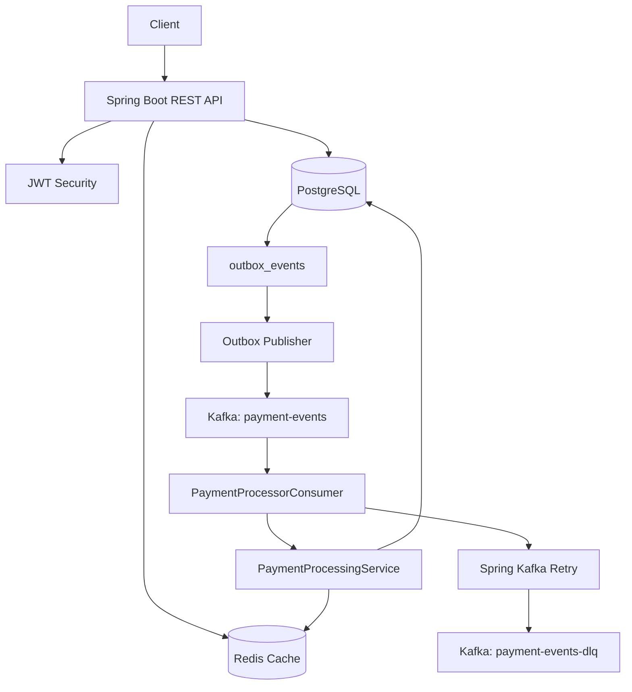
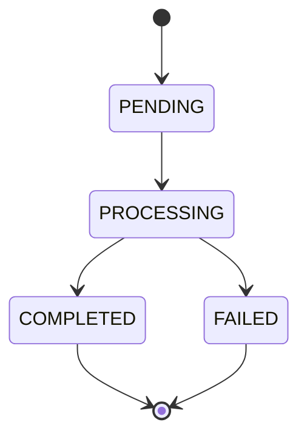

# Payment Processing System

A production-style Java 17/Spring Boot 3 backend that simulates payment creation and asynchronous processing. It demonstrates REST API design, JWT authentication, PostgreSQL transactions, database-backed idempotency, a transactional outbox, Kafka processing with bounded retries and DLQ, Redis read caching, Flyway migrations, validation, centralized error handling, and tests.

## Architecture



The API commits payment state, audit records, and outbox events in one PostgreSQL transaction. Kafka publication happens later from the outbox so a crash after database commit does not lose the payment event.

## Technology Stack

- Java 17, Spring Boot 3, Maven
- Spring Web, Spring Security, Spring Data JPA, Hibernate
- PostgreSQL with Flyway migrations
- Redis for read-through payment caching
- Apache Kafka with Spring Kafka
- JWT using `jjwt`, BCrypt passwords
- JUnit 5, Mockito, Testcontainers
- Docker and Docker Compose
- Springdoc OpenAPI and Spring Boot Actuator

## API Endpoints

| Method | Path | Auth | Purpose |
| --- | --- | --- | --- |
| `POST` | `/api/auth/register` | No | Register user and return JWT |
| `POST` | `/api/auth/login` | No | Login and return JWT |
| `POST` | `/api/payments` | Yes | Create a payment using `Idempotency-Key` |
| `GET` | `/api/payments/{paymentId}` | Yes | Retrieve one owned payment, Redis cached |
| `GET` | `/api/payments` | Yes | List owned payments with pagination and optional status |
| `GET` | `/swagger-ui/index.html` | No | Swagger UI |
| `GET` | `/actuator/health` | No | Health endpoint |

## Example Flow

Register:

```bash
curl -X POST http://localhost:8080/api/auth/register \
  -H 'Content-Type: application/json' \
  -d '{"email":"user@example.com","password":"password123"}'
```

Login:

```bash
curl -X POST http://localhost:8080/api/auth/login \
  -H 'Content-Type: application/json' \
  -d '{"email":"user@example.com","password":"password123"}'
```

Create payment:

```bash
curl -X POST http://localhost:8080/api/payments \
  -H "Authorization: Bearer $TOKEN" \
  -H 'Idempotency-Key: payment-123' \
  -H 'Content-Type: application/json' \
  -d '{"amount":100.50,"currency":"USD","paymentMethod":"CARD"}'
```

Retrieve payment:

```bash
curl -H "Authorization: Bearer $TOKEN" \
  http://localhost:8080/api/payments/{paymentId}
```

List completed payments:

```bash
curl -H "Authorization: Bearer $TOKEN" \
  'http://localhost:8080/api/payments?status=COMPLETED&page=0&size=20'
```

## Database Schema

Flyway owns schema creation in `src/main/resources/db/migration/V1__init_schema.sql`; Hibernate runs with `ddl-auto=validate`.

Tables:

- `users`: unique email, BCrypt password hash, timestamps.
- `payments`: amount, currency, status, payment method, user ownership, idempotency key, optimistic `version`.
- `payment_transactions`: append-only audit trail for each payment state transition.
- `outbox_events`: durable events waiting to be published to Kafka.

Important constraints:

- `users.email` is unique to prevent duplicate accounts.
- `(payments.user_id, payments.idempotency_key)` is unique to guarantee duplicate create requests return the original payment even across multiple app instances.
- Foreign keys connect payments to users and transactions to payments.
- Check constraints restrict payment statuses and payment methods.

Indexes:

- `idx_users_email`: fast login and registration uniqueness checks.
- `idx_payments_user_id`: fast owned payment listing.
- `idx_payments_status`: efficient operational/status filtering.
- `idx_payments_created_at`: stable pagination and recent-payment queries.
- `idx_payments_idempotency_key`: fast idempotency lookup.
- `idx_outbox_events_status_created_at`: efficient pending outbox polling.

## Idempotency

`POST /api/payments` requires `Idempotency-Key`. The service first checks for an existing `(user_id, idempotency_key)` payment. The database unique constraint is the final authority, so simultaneous requests cannot create duplicates.

If two requests race:

1. Both attempt to create the payment.
2. One insert commits.
3. The other hits the unique constraint.
4. The service loads and returns the original payment.

This works with multiple application instances because correctness lives in PostgreSQL, not in local memory.

## Transactional Outbox

Payment creation writes three things in one transaction:

1. `payments` row with `PENDING`.
2. `payment_transactions` row with `PAYMENT_CREATED`.
3. `outbox_events` row containing the `PAYMENT_CREATED` event.

`OutboxPublisher` polls pending events, publishes to Kafka, and marks them `PROCESSED`. If publishing fails, the event is marked `FAILED` for operator inspection. This avoids the classic failure where the database commit succeeds but Kafka publishing is lost during a process crash.

## Kafka Processing, Retry, and DLQ

Topic:

- `payment-events`

Dead letter topic:

- `payment-events-dlq`

Example event:

```json
{
  "eventId": "f1c4b4c6-7aa1-4818-b1e0-f9c24466500f",
  "paymentId": "7b21e786-eac2-4c08-a65b-36f914209d7b",
  "userId": "0fb1df72-9e2d-455e-ad43-aaf7500747f2",
  "amount": 100.50,
  "currency": "USD",
  "eventType": "PAYMENT_CREATED",
  "timestamp": "2026-09-15T17:00:00Z"
}
```

`PaymentProcessorConsumer` locks the payment row, moves `PENDING -> PROCESSING`, simulates gateway processing, then moves to `COMPLETED`. Simulated temporary failures are retried by Spring Kafka using:

- `MAX_RETRIES`, default `3`
- `RETRY_BACKOFF_MS`, default `2000`

After retries are exhausted, the service marks the payment `FAILED`, writes a failure audit row, and publishes a `PaymentDlqEvent` containing the original event, error message, timestamp, retry count, and payment ID.

Operators can inspect the DLQ with:

```bash
docker compose exec kafka /opt/kafka/bin/kafka-console-consumer.sh \
  --bootstrap-server kafka:9092 \
  --topic payment-events-dlq \
  --from-beginning
```

Reprocessing can be done by validating/fixing the cause and republishing the original event payload to `payment-events`.

## Redis Caching

`GET /api/payments/{paymentId}` uses Redis key `payment:{paymentId}` with a default TTL of 5 minutes.

Read flow:

1. Attempt Redis lookup.
2. Verify the payment is owned by the authenticated user.
3. On miss, query PostgreSQL.
4. Cache the response.

Status transitions evict the payment cache entry. Redis failures are logged and ignored; PostgreSQL remains the source of truth.

## Payment State Machine

Valid transitions:



`PaymentStateMachine` rejects invalid transitions such as `COMPLETED -> PROCESSING` or `FAILED -> COMPLETED`.

## Concurrency Decisions

- Idempotency uses a unique database constraint, not process-local memory.
- Kafka processing uses `PESSIMISTIC_WRITE` row locking when changing payment state.
- Payments also include a JPA `@Version` column for optimistic protection in ordinary updates.
- Terminal statuses are idempotent for consumers; duplicate Kafka deliveries are skipped if payment is already `COMPLETED` or `FAILED`.
- Redis is never trusted as the source of authorization or state.

## Running Locally

With Docker:

```bash
cp .env.example .env
docker compose up --build
```

Application:

- API: `http://localhost:8080`
- Swagger: `http://localhost:8080/swagger-ui/index.html`
- Health: `http://localhost:8080/actuator/health`

Without Docker, run PostgreSQL, Redis, and Kafka yourself, then set:

```bash
export DB_HOST=localhost
export DB_PORT=5432
export DB_NAME=payments
export DB_USERNAME=payments
export DB_PASSWORD=payments
export REDIS_HOST=localhost
export REDIS_PORT=6379
export KAFKA_BOOTSTRAP_SERVERS=localhost:9092
export JWT_SECRET=replace-with-at-least-32-bytes-of-random-secret
mvn spring-boot:run
```

## Configuration

All important values are environment-driven:

- `DB_HOST`, `DB_PORT`, `DB_NAME`, `DB_USERNAME`, `DB_PASSWORD`
- `REDIS_HOST`, `REDIS_PORT`
- `KAFKA_BOOTSTRAP_SERVERS`
- `JWT_SECRET`, `JWT_EXPIRATION`
- `MAX_RETRIES`, `RETRY_BACKOFF_MS`
- `PAYMENT_CACHE_TTL`
- `OUTBOX_BATCH_SIZE`, `OUTBOX_FIXED_DELAY_MS`
- `GATEWAY_DETERMINISTIC_FAIL_MODULO`

## Testing

Run unit tests and Docker-backed integration tests:

```bash
mvn test
```

The integration test uses Testcontainers for PostgreSQL, Redis, and Kafka. If Docker is unavailable, Testcontainers skips those integration tests while unit tests still run.

Run a full package:

```bash
mvn clean package
```

## Project Structure

```text
src/main/java/com/paymentprocessing
├── cache
├── config
├── controller
├── dto
├── entity
├── exception
├── kafka
├── mapper
├── repository
├── security
├── service
└── util
```

## Design Tradeoffs

- The gateway is deterministic and simulated so the project remains self-contained.
- The outbox publisher marks publish failures as `FAILED`; a production version would usually support retrying failed outbox rows with attempt counts.
- The DLQ envelope is produced by the Kafka recoverer after bounded retries instead of relying only on framework exception headers.
- Cache authorization still checks PostgreSQL ownership to avoid cross-user leakage from a payment-ID-only cache key.
- Kafka topic replication is `1` in Docker Compose for local development; production should use higher replication and ISR settings.

## Future Improvements

- Add operator APIs or jobs for outbox replay and DLQ reprocessing.
- Add Micrometer dashboards and alerting for outbox lag, DLQ volume, and payment failure rate.
- Add refresh tokens and key rotation for JWT.
- Add multi-currency normalization rules and stricter amount scale validation by currency.
- Add contract tests for Kafka event schemas.
- Add rate limiting for auth and payment creation endpoints.
